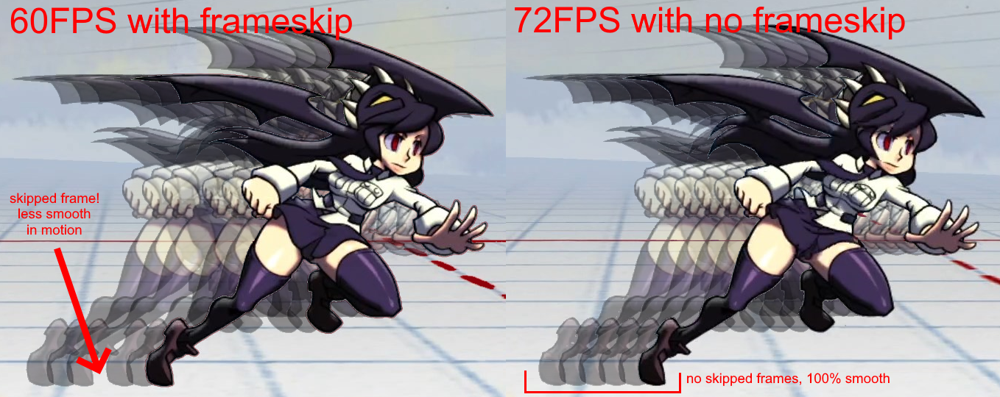
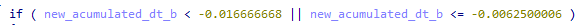
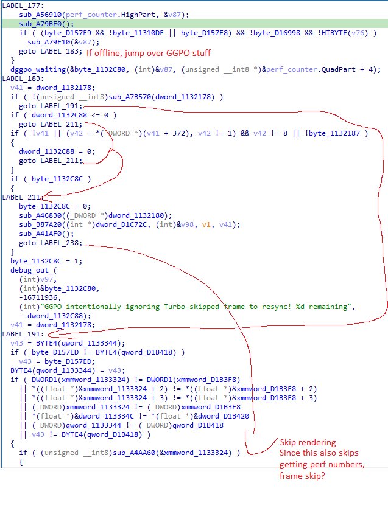
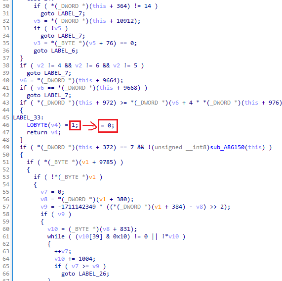

# Info
This patch changes the game to run at 72fps (instead of 60) and disables frameskip, leaving the timing of the game identical (ish, I'm sure there's some edge cases) but looks and feels smooooottthhh.

Since the main menu doesn't use frameskip its speed is increased by 20% as a side effect.

#### IMPORTANT

* This patcher only works with [June 12th Retail Update](https://wiki.gbl.gg/w/Skullgirls/Patch_Notes#Retail_Update_[6/12/2024])
* You'll need a monitor that's higher than 60hz
* Don't try to play online

# Installation

[Download the latest release .zip](https://github.com/IHaveNoFunnyName/SkullGirls-72fps/releases/download/June-12/sg-72fps-patch-for-june-12-update.zip) and extract it into the folder with SkullGirls.exe (...Steam\steamapps\common\Skullgirls) and run patch-to-72fps.bat

The patch also creates SkullGirls.bak as a backup.

You can delete patched SkullGirls.exe and rename SkullGirls.bak to SkullGirls.exe to undo the patch (or use steam to verify files)

# Development
##### (Since the patch will have to be remade every well, patch, this also doubles as notes for myself to do it fast next time)
I used IDA to disassemble the game and figure out what to change.

#### 72fps
The fps of the game is stored as a floating point with the value of 1/60 / `3C888889`, updated to 1/72 / `3C638E39` there is only one address with that value at the time of writing so this will be easy to find on updates.

There's another value of -1/60 / `0BC888889`, updated to -1/72 `BC638E45`, but i'm fairly certain that value doesn't actually do anything.

(The right side implies the left, and the left side uses -1/60)

#### Disabling frameskip

After a couple hours of fruitless searching I spotted the "GGPO intentionally ignoring Turbo-skipped frame" text and remembered the update a while ago that made the netcode even better by disabling frameskip during lag spikes to re-sync clients, that sounds like this so I screenshot the section and started drawing red arrows to visualize the program flow.

I noticed that LABEL_238 skips like the entire rest of the function including (what i assume is) rendering the frame. I thought this could do frameskip, as if it also skips where it sleeps between frames then it'd run the gameplay logic again instantly.

Thinking about how to ensure that `goto LABEL_238` is never run I noticed the  `goto LABEL_191` that seemed to do the job, if I could make the `if(stuff)` `if(1)` then it would always run that jump and skip frameskip.

Unfortunately, IDA can not do that sort of assembly editing (afaik), limited to commands that are the same length in bytes and i don't know enough assembly to know what would work there.

So I edited that function and ensured it always returns 0.

Then I ran SkullGirls and it worked! 72 fps, same gameplay speed as 60fps, no frameskip (Confirmed by frame advancing a 72fps obs recording)

Since that function is used 15 other places in the code I have no idea what side effects it has or what might just not work, but hey, it hasn't crashed and i haven't noticed anything wrong yet (except online play, dur)

(I showed pseudocode in these images but to make the changes you have to find what assembly the pseudocode correlates to and make the changes there)

# License

People use MIT for stuff like this, right? So that. 

This project uses `bspatch.exe` which requires the inclusion of its license, which is available at `bspath-license`.
